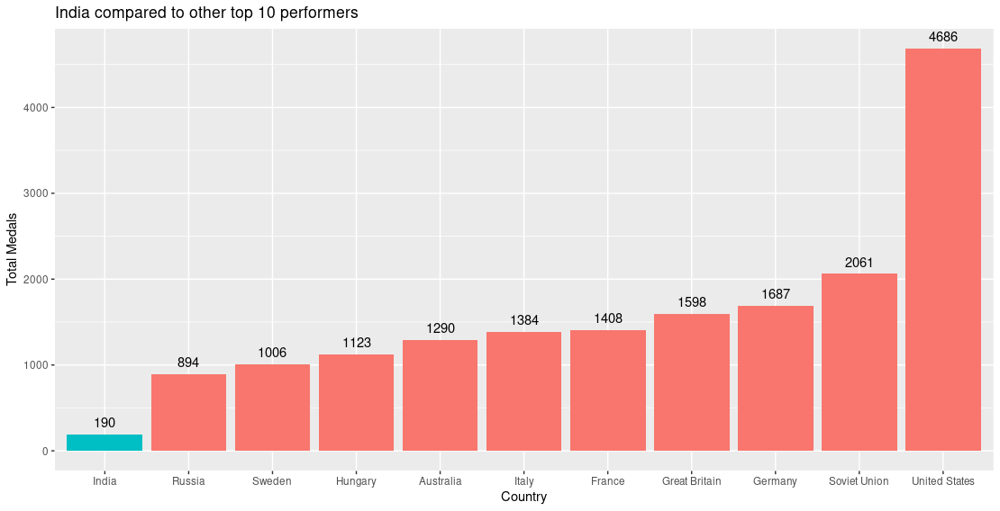
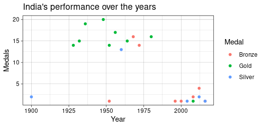
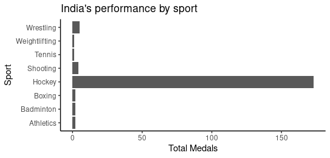
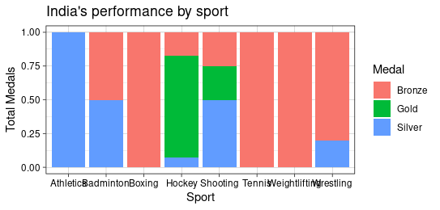

# India at the Olympics

This is a statistical analysis of India's performance at the Olympics over the years. This analysis tries to answer (or ask!) questions as to why, when and how India's performance has been impacted by various factors. It also tries to compare India's performance against the other countries which are either considered equivalent or better developed than India.

Note: This analysis is done in R using Rstudio. The code mentioned in this document can be used to recreate the analysis

## Initial analysis: India and the rest of the world at the olympics

Let's compare India's performance to other top performing nations at the Olympics over the entire span.


```r
# Load data
medalists <- read.csv('archive/athlete_events.csv', stringsAsFactors = FALSE) %>% 
  filter(Season == 'Summer', Medal %in% c('Gold','Silver','Bronze')) %>% 
  select(Sex, Age, Team, NOC, Year, City, Sport, Medal)

# India compared to the top 10 ----
tally <- medalists %>%  
  group_by(Team) %>% 
    summarise(Total = n()) %>% 
      arrange(desc(Total))

# Data pre-processing
tally$Team <- factor(tally$Team) %>% fct_reorder(tally$Total)
top10 <- tally %>% arrange(desc(Total)) %>% top_n(10)
top10_india <- top10 %>% add_row(tally %>% filter(Team == 'India'))
top10_india$Team <- factor(top10_india$Team) %>% 
                      fct_reorder(top10_india$Total)
if_india <- factor(c(0,0,0,0,0,0,0,0,0,0,1))
top10_india <- top10_india %>% add_column(if_india)

# Charting
top10_india %>% 
  ggplot(aes(x = Team, y =Total, fill = if_india)) +
  geom_col(show.legend = FALSE) +
  geom_text(aes(x = Team, y = Total, label = Total, vjust = -0.7)) +
  labs(x = 'Country', y = 'Total Medals', 
       title = 'India compared to other top 10 performers')
```




## India's performance over the years
This is how India has performed over the years at the Olympics. As we can see, it has been highly inconsistent throughout, with a peak of medals in the middle of the 20th century and then waning off to lower numbers.
A better insight can explain this phenomenon when we compare India's performance across various sports. It is seen that hockey has been predominant sport for India's performance in the Olympics and accounts for more almost 90% of the medals India has.
```r
# India's Performance over the years ----
df <- medalists %>% 
  filter(Team == 'India') %>% 
    group_by(Year,Medal) %>% 
      summarise(Total = n())
df
df %>% 
ggplot(aes(x = Year, y = Total, colour = Medal)) + theme_linedraw() + 
  geom_point() + 
  labs(y = "Medals", title = "India's performance over the years")

rm(df)


# India's sport-wise performance ----
medalists %>% 
  filter(Team == 'India') %>% 
    group_by(Sport,Medal) %>% 
      summarise(Total = n()) %>% 
ggplot(aes(x = Sport, y = Total, fill = Medal)) + theme_linedraw() + 
  geom_col(position = 'fill') + 
  # geom_text(aes(label = round(Total/sum(Total),2)), nudge_y = 0.0) +
  labs(y = "Total Medals", title = "India's performance by sport")

```
 

### Sportwise analysis
Here we can see that Most of India's Gold medals are from Hockey only with 1 singular gold from shooting. Rest all sports have never earned a gold medal for India.


